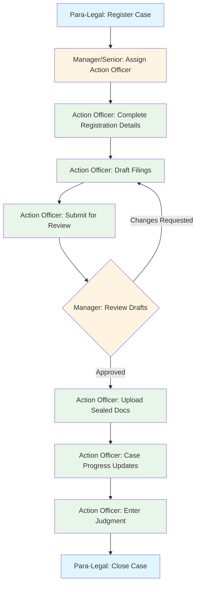

# Litigation Case Management Workflow Guide

## Overview

This guide describes the complete litigation case management workflow from case registration to closure, aligned with the Department of Lands & Physical Planning's litigation processes.

---

## Workflow Stages



---

## Roles & Permissions

### 1. Para-Legal Officer (`para_legal_officer`)

**Responsibilities:**
- Register new litigation cases
- Upload incoming court documents
- Set returnable date alerts
- Close cases after judgment/conclusion notice

**Workflow States:**
- Can create: `REGISTERED`
- Can transition: `JUDGMENT_ENTERED` → `CLOSED`

### 2. Manager Legal Services / Senior Legal Officer (`manager_legal_services`, `senior_legal_officer_litigation`)

**Responsibilities:**
- Review new registered cases
- Assign action officers (litigation lawyers)
- Review draft filings
- Approve or request changes to filings

**Workflow States:**
- Can transition: `REGISTERED` → `ASSIGNED`
- Can transition: `UNDER_REVIEW` → `APPROVED_FOR_FILING` or back to `DRAFTING`

### 3. Action Officer / Litigation Lawyer (`action_officer_litigation_lawyer`)

**Responsibilities:**
- Complete registration details (land refs, allegations, etc.)
- Draft court filings (defence, statements, affidavits, etc.)
- Submit filings for manager review
- Upload sealed/filed documents
- Update case progress (hearings, mediation, etc.)
- Enter judgment and compliance memos

**Workflow States:**
- Can transition: `ASSIGNED` → `REGISTRATION_COMPLETED`
- Can transition: `REGISTRATION_COMPLETED` → `DRAFTING`
- Can transition: `DRAFTING` → `UNDER_REVIEW`
- Can transition: `APPROVED_FOR_FILING` → `FILED`
- Can transition: `FILED` → `IN_PROGRESS`
- Can transition: `IN_PROGRESS` → `JUDGMENT_ENTERED`

---

## Workflow States

| State | Description | Who Can Set |
|-------|-------------|-------------|
| `REGISTERED` | Case created by para-legal with initial docs | Para-Legal |
| `ASSIGNED` | Manager assigned action officer | Manager/Senior |
| `REGISTRATION_COMPLETED` | Action officer completed extended details | Action Officer |
| `DRAFTING` | Filings being prepared | Action Officer |
| `UNDER_REVIEW` | Manager reviewing draft filings | Action Officer (submits) |
| `APPROVED_FOR_FILING` | Manager approved filings | Manager/Senior |
| `FILED` | Sealed docs uploaded, filed with court | Action Officer |
| `IN_PROGRESS` | Case progressing (hearings, mediation, etc.) | Action Officer |
| `JUDGMENT_ENTERED` | Judgment and compliance memo entered | Action Officer |
| `CLOSED` | Case closed by para-legal | Para-Legal |

---

## Detailed Process Steps

### Step 1: Para-Legal Registration

**Page:** `/cases/register-litigation` (to be created)

**Fields Required:**
- Case reference number (auto-generated if blank)
- Mode of proceeding (writ, summons, petition, etc.)
- Type of court document
- Parties description
- Date proceeding filed
- Plaintiff lawyer contact (JSONB: name, firm, phone, email, address)
- OSG lawyer contact (JSONB: name, phone, email)
- Returnable date
- Upload court documents

**Actions:**
1. Create case with `workflow_state = 'REGISTERED'`
2. Create event/alert for returnable date (3-day and 1-day reminders)
3. Notify all managers/senior legal officers
4. Record in case_history

**API Endpoint:** `POST /api/cases/register`

---

### Step 2: Manager/Senior Assignment

**Page:** `/cases/assignment-inbox` (to be created)

**Process:**
1. View list of cases in `REGISTERED` state
2. Select action officer (litigation lawyer)
3. Add assignment notes

**Actions:**
1. Create record in `case_delegations` table
2. Update `cases.assigned_officer_id` and `officer_assigned_date`
3. Set `workflow_state = 'ASSIGNED'`
4. Notify assigned action officer
5. Record in case_history

**API Endpoint:** `POST /api/cases/assign`

---

### Step 3: Action Officer - Complete Registration

**Page:** `/cases/[id]/complete-registration` (to be created)

**Additional Fields:**
- Land description / land file refs
- Title file refs
- Survey refs
- Purchase documents refs
- ILG (Incorporated Land Group) refs
- Allegations / cause of action
- Legal issues
- Reliefs sought
- Cost/damages estimate

**Actions:**
1. Update case with extended details
2. Set `workflow_state = 'REGISTRATION_COMPLETED'`
3. Record in case_history

**API Endpoint:** `PATCH /api/cases/[id]/complete-registration`

---

### Step 4: Action Officer - Draft Filings

**Page:** `/cases/[id]/filings` (to be created/updated)

**Filing Types:**
- Defence
- Statement of Disputed Facts
- Statement of Agreed Facts
- Affidavit
- Instruction Letter
- Brief-out Request
- Notice of Motion
- Written Submissions
- Other

**Process:**
1. Create filing record with `status = 'draft'`
2. Upload draft document
3. Repeat for all required filings
4. Click "Submit All for Review"

**Actions:**
1. Insert records into `filings` table
2. Set `workflow_state = 'DRAFTING'` (first filing)
3. On submit for review: Set `workflow_state = 'UNDER_REVIEW'`
4. Notify managers
5. Record in case_history

**API Endpoints:**
- `POST /api/filings/create`
- `POST /api/filings/submit-for-review`

---

### Step 5: Manager - Review Drafts

**Page:** `/filings/review-inbox` (to be created)

**Process:**
1. View cases with filings `UNDER_REVIEW`
2. Review each filing
3. Provide decision:
   - **Approved:** Ready for sealing/filing
   - **Changes Requested:** Specify required changes
   - **Rejected:** Not suitable (rare)

**Actions:**
1. Create record in `filing_reviews` table
2. Update filing status based on decision
3. If all approved: `workflow_state = 'APPROVED_FOR_FILING'`
4. If changes requested: `workflow_state = 'DRAFTING'`
5. Notify action officer
6. Record in case_history

**API Endpoint:** `POST /api/filings/review`

---

### Step 6: Action Officer - Upload Sealed Documents

**Page:** `/cases/[id]/filings`

**Process:**
1. View approved filings
2. Upload signed/sealed versions
3. Enter court filing date and reference

**Actions:**
1. Update `filings` table:
   - Set `sealed_file_url`
   - Set `court_filing_date`
   - Set `status = 'filed'`
2. Set `workflow_state = 'FILED'`
3. Record in case_history

**API Endpoint:** `PATCH /api/filings/[id]/upload-sealed`

---

### Step 7: Action Officer - Case Progress Updates

**Page:** `/cases/[id]/progress` (to be created)

**Update Types:**
- Leave Granted
- Directions Hearing
- Pre-Trial Conference (PTC)
- Trial
- Mediation
- Arbitration
- Settlement Conference
- Interlocutory Application
- Taxation of Costs
- Appeal Filed

**Actions:**
1. Insert record into `case_progress_updates`
2. Set `workflow_state = 'IN_PROGRESS'` (first update)
3. Create event if date provided
4. Record in case_history

**API Endpoint:** `POST /api/cases/progress-update`

---

### Step 8: Action Officer - Enter Judgment

**Page:** `/cases/[id]/judgment` (to be created)

**Fields:**
- Judgment date
- Judgment type (final, interlocutory, default, etc.)
- Decision summary
- Terms of orders
- Judges' names
- Upload judgment document
- Upload compliance memo (signed)
- Compliance notes

**Actions:**
1. Insert record into `case_judgments`
2. Set `workflow_state = 'JUDGMENT_ENTERED'`
3. Notify managers, senior officers, and para-legal
4. Record in case_history

**API Endpoint:** `POST /api/cases/judgment`

---

### Step 9: Para-Legal - Close Case

**Page:** `/cases/[id]/close` (to be created)

**Fields:**
- Court order date
- Closure type:
  - Dismissed
  - Withdrawn
  - Settled
  - Judicial Review Upheld
  - Judicial Review Dismissed
  - Appeal Allowed
  - Appeal Dismissed
  - Struck Out
  - Other
- Closure notes

**Actions:**
1. Update case:
   - Set `status = 'closed'`
   - Set `workflow_state = 'CLOSED'`
   - Set `closure_date`, `closure_type`, `court_order_date`
2. Notify assigned officer and managers
3. Record in case_history

**API Endpoint:** `POST /api/cases/close`

---

## Database Tables

### Main Tables

1. **`cases`** - Core case information + litigation fields + workflow_state
2. **`case_delegations`** - Assignment history (source of truth for assignments)
3. **`filings`** - Court documents with draft/sealed versions
4. **`filing_reviews`** - Manager review actions
5. **`case_progress_updates`** - Stage updates (hearings, mediation, etc.)
6. **`case_judgments`** - Judgment and compliance memos
7. **`case_history`** - Complete audit trail with workflow transitions

### Supporting Tables

- **`profiles`** - Users with litigation roles
- **`events`** - Returnable dates and hearing schedule
- **`notifications`** - Workflow notifications
- **`documents`** - General document storage

---

## API Routes Summary

| Endpoint | Method | Purpose | Who Can Access |
|----------|--------|---------|----------------|
| `/api/cases/register` | POST | Register new case | Para-Legal, Admin |
| `/api/cases/assign` | POST | Assign action officer | Manager/Senior, Admin |
| `/api/cases/[id]/complete-registration` | PATCH | Add extended details | Action Officer, Admin |
| `/api/filings/create` | POST | Create draft filing | Action Officer, Admin |
| `/api/filings/submit-for-review` | POST | Submit for manager review | Action Officer, Admin |
| `/api/filings/review` | POST | Review filing | Manager/Senior, Admin |
| `/api/filings/[id]/upload-sealed` | PATCH | Upload sealed doc | Action Officer, Admin |
| `/api/cases/progress-update` | POST | Add progress update | Action Officer, Admin |
| `/api/cases/judgment` | POST | Enter judgment | Action Officer, Admin |
| `/api/cases/close` | POST | Close case | Para-Legal, Admin |

---

## Notifications & Alerts

### Automatic Notifications

1. **Case Registered** → Managers/Senior Officers
2. **Action Officer Assigned** → Assigned Action Officer
3. **Filings Submitted for Review** → Managers/Senior Officers
4. **Review Decision** → Action Officer
5. **Judgment Entered** → Managers, Senior Officers, Para-Legal
6. **Case Closed** → Assigned Officer, Managers

### Returnable Date Alerts

- **3 days before:** Email/system notification
- **1 day before:** Email/system notification
- **On the day:** System alert

---

## Testing Checklist

### Happy Path Test

1. ✅ Para-Legal registers case → `REGISTERED`
2. ✅ Manager assigns action officer → `ASSIGNED`
3. ✅ Action officer completes details → `REGISTRATION_COMPLETED`
4. ✅ Action officer creates draft filings → `DRAFTING`
5. ✅ Action officer submits for review → `UNDER_REVIEW`
6. ✅ Manager approves filings → `APPROVED_FOR_FILING`
7. ✅ Action officer uploads sealed docs → `FILED`
8. ✅ Action officer adds progress update → `IN_PROGRESS`
9. ✅ Action officer enters judgment → `JUDGMENT_ENTERED`
10. ✅ Para-legal closes case → `CLOSED`

### Review Changes Flow

1. Action officer drafts filings → `DRAFTING`
2. Submits for review → `UNDER_REVIEW`
3. Manager requests changes → back to `DRAFTING`
4. Action officer revises and resubmits → `UNDER_REVIEW`
5. Manager approves → `APPROVED_FOR_FILING`

---

## Migration Instructions

1. **Run Migration SQL:**
   ```bash
   # In Supabase SQL Editor
   Run: crs/LITIGATION_WORKFLOW_MIGRATION.sql
   ```

2. **Verify Tables Created:**
   - case_delegations
   - filings
   - filing_reviews
   - case_progress_updates
   - case_judgments

3. **Update Existing Cases:**
   ```sql
   -- Set workflow_state for existing cases
   UPDATE cases SET workflow_state = 'REGISTERED' WHERE workflow_state IS NULL;
   ```

4. **Test API Routes:**
   - Use Postman or similar tool
   - Test each endpoint with sample data
   - Verify notifications sent

5. **Deploy UI Pages:**
   - Create pages listed in workflow steps
   - Test complete workflow end-to-end

---

## Support & Maintenance

**Database Schema Version:** 1.0
**Last Updated:** February 2026
**Maintained by:** Legal Services IT Team

For issues or questions, contact: support@dlpp.gov.pg

---

## Appendix: Workflow State Machine

```
REGISTERED
    ↓ (Manager assigns)
ASSIGNED
    ↓ (Action Officer completes details)
REGISTRATION_COMPLETED
    ↓ (Action Officer starts drafting)
DRAFTING
    ↓ (Action Officer submits for review)
UNDER_REVIEW
    ↓ (Manager reviews)
    ├─→ APPROVED_FOR_FILING (approved)
    └─→ DRAFTING (changes requested)
APPROVED_FOR_FILING
    ↓ (Action Officer uploads sealed)
FILED
    ↓ (Action Officer adds progress)
IN_PROGRESS
    ↓ (Action Officer enters judgment)
JUDGMENT_ENTERED
    ↓ (Para-Legal closes)
CLOSED
```

**State Validation:** All transitions are validated by the `validate_workflow_transition()` database function based on user role.
