# Logical Design - DLPP Legal Case Management System

**System**: DLPP Legal Case Management System
**Version**: 1.0
**Date**: December 10, 2025
**Type**: Cloud-Based Web Application

---

## 1. Executive Summary

The DLPP Legal Case Management System is a comprehensive, cloud-based solution designed to manage the complete lifecycle of legal cases for the Department of Lands & Physical Planning. The system implements a 7-step iterative workflow with role-based access control, document management, and compliance tracking.

---

## 2. System Architecture Overview

### 2.1 Three-Tier Architecture

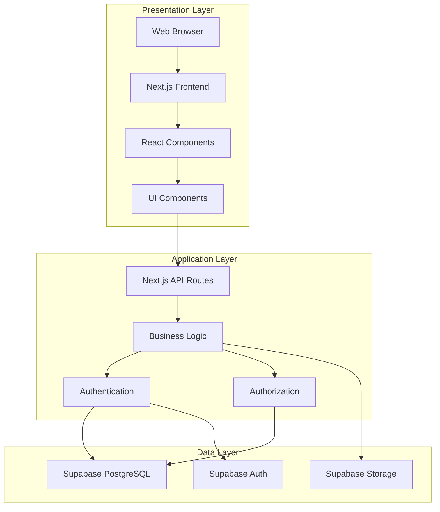

### 2.2 System Layers

| Layer | Purpose | Technologies |
|-------|---------|--------------|
| **Presentation** | User interface and interaction | Next.js, React, Tailwind CSS, shadcn/ui |
| **Application** | Business logic and processing | Next.js API Routes, TypeScript |
| **Data** | Data persistence and storage | PostgreSQL, File Storage, Authentication |

---

## 3. Logical Component Model

### 3.1 High-Level Components

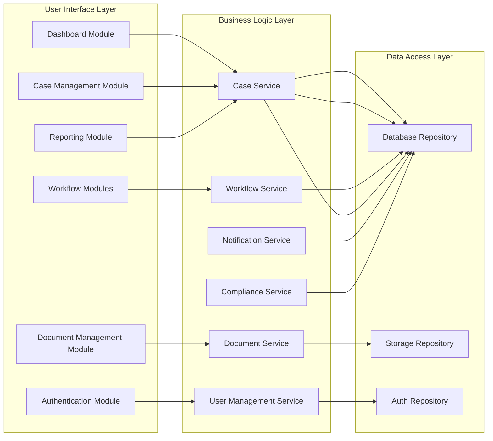

### 3.2 Component Descriptions

#### **User Interface Layer**

1. **Authentication Module**
   - User login/logout
   - Session management
   - Password reset
   - Access control

2. **Dashboard Module**
   - Key metrics display
   - Workflow statistics
   - Pending alerts
   - Quick actions

3. **Case Management Module**
   - Case registration
   - Case viewing/editing
   - Case search
   - Case history

4. **Workflow Modules** (7 Steps)
   - Step 1: Case Registration
   - Step 2: Directions
   - Step 3: Case Allocation
   - Step 4: Litigation Workspace
   - Step 5: Compliance Tracking
   - Step 6: Case Closure
   - Step 7: Party Notifications

5. **Document Management Module**
   - Document upload
   - Document viewing
   - Document download
   - Document organization

6. **Reporting Module**
   - Statistical reports
   - Export capabilities
   - Custom queries

#### **Business Logic Layer**

1. **User Management Service**
   - User CRUD operations
   - Role assignment
   - Permission management
   - Activity logging

2. **Case Service**
   - Case lifecycle management
   - Status tracking
   - History recording
   - Data validation

3. **Workflow Service**
   - Step progression
   - Assignment management
   - Deadline tracking
   - Iterative cycle support

4. **Document Service**
   - File upload/download
   - Metadata management
   - Version control
   - Security enforcement

5. **Notification Service**
   - Alert generation
   - Email notifications
   - In-app notifications
   - Recipient management

6. **Compliance Service**
   - Court order tracking
   - Deadline monitoring
   - Division coordination
   - Compliance reporting

---

## 4. Data Flow Architecture

### 4.1 Case Registration Flow

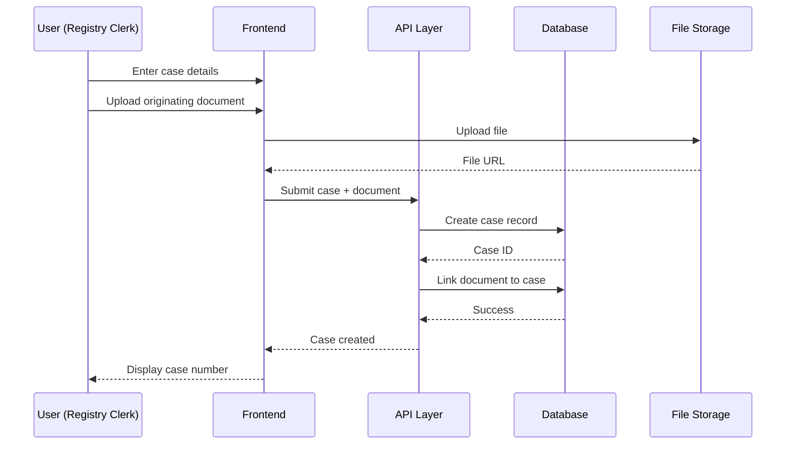

### 4.2 Alert Workflow Flow

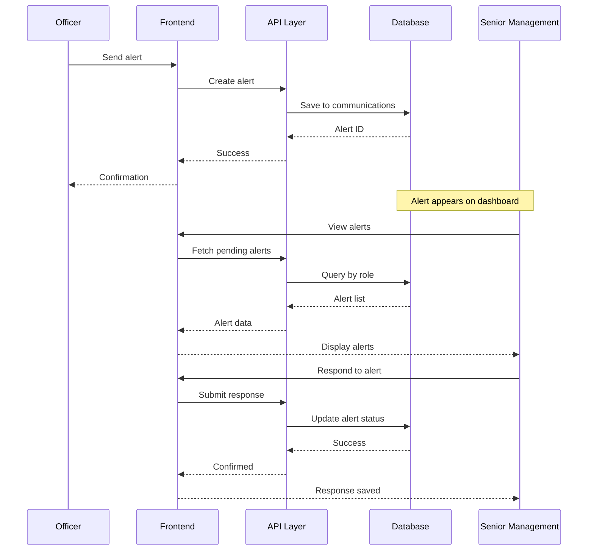

### 4.3 Document Upload Flow

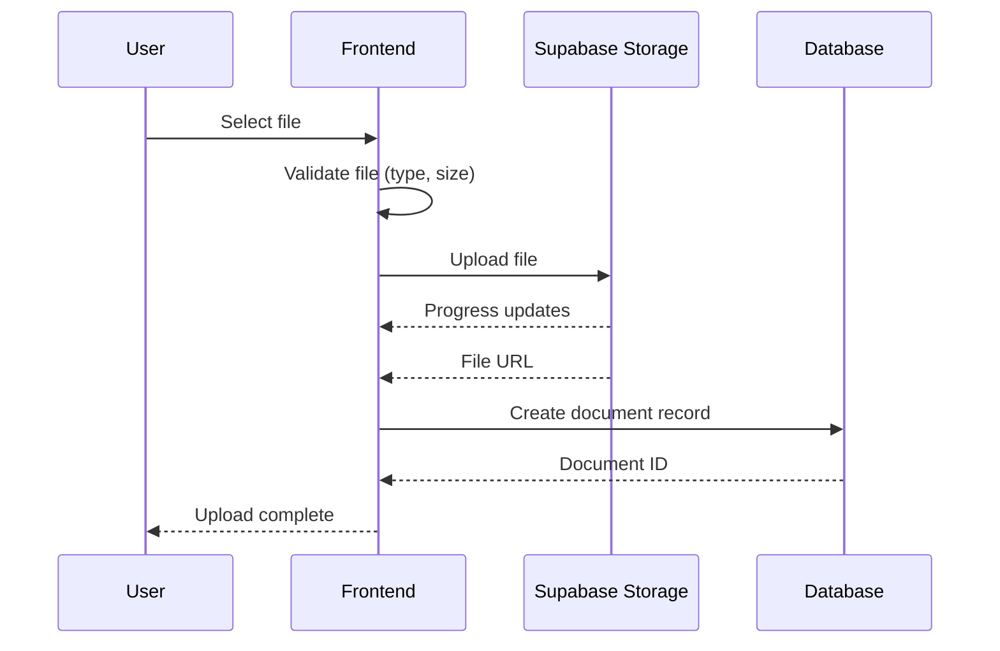

---

## 5. User Interaction Model

### 5.1 User Roles and Access

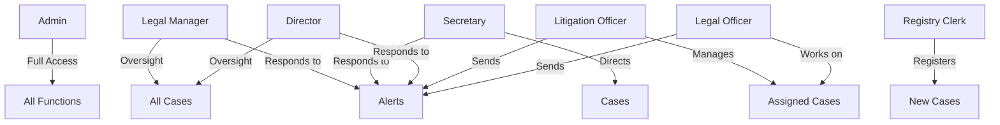

### 5.2 Access Control Matrix

| Role | Case Registration | Directions | Allocation | Litigation | Compliance | Closure | Notifications | Admin |
|------|------------------|------------|------------|------------|------------|---------|---------------|-------|
| Admin | ✅ | ✅ | ✅ | ✅ | ✅ | ✅ | ✅ | ✅ |
| Legal Manager | ✅ | ✅ | ✅ | ✅ | ✅ | ✅ | ✅ | ❌ |
| Secretary | ✅ | ✅ | ❌ | ❌ | ❌ | ❌ | ✅ | ❌ |
| Director | ✅ | ✅ | ✅ | ✅ | ✅ | ✅ | ✅ | ❌ |
| Litigation Officer | ❌ | ❌ | ❌ | ✅ | ✅ | ✅ | ✅ | ❌ |
| Legal Officer | ❌ | ❌ | ❌ | ✅ | ✅ | ❌ | ✅ | ❌ |
| Registry Clerk | ✅ | ❌ | ❌ | ❌ | ❌ | ❌ | ❌ | ❌ |

---

## 6. Business Process Model

### 6.1 Complete Workflow Diagram

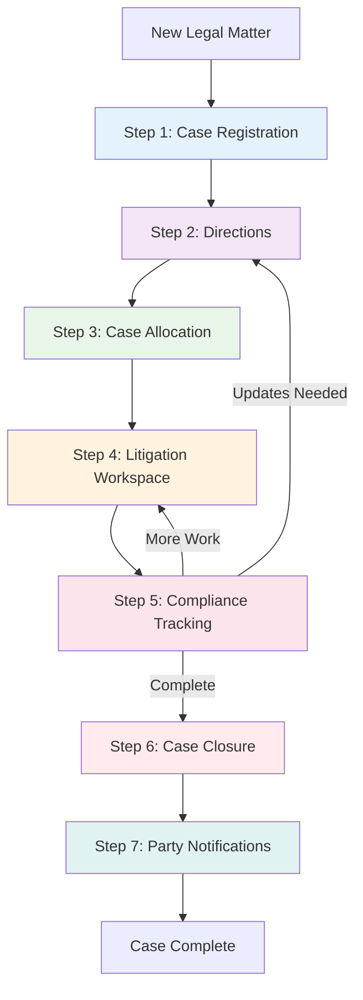

### 6.2 Iterative Cycle Detail

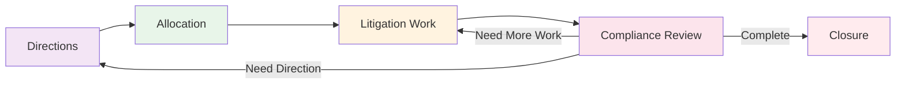

---

## 7. Data Model (Logical View)

### 7.1 Entity Relationship Diagram

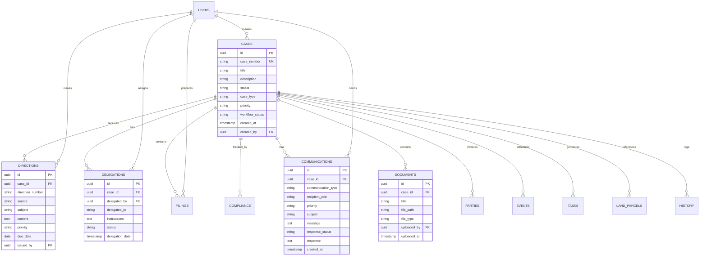

### 7.2 Core Entities

| Entity | Purpose | Key Attributes |
|--------|---------|----------------|
| **Cases** | Master case records | case_number, title, status, workflow_status |
| **Directions** | Authority instructions | source, subject, content, priority |
| **Delegations** | Case assignments | delegated_to, instructions, status |
| **Filings** | Litigation documents | filing_type, title, prepared_date |
| **Compliance** | Court order tracking | court_order_description, deadline, status |
| **Communications** | Alerts & notifications | type, recipient_role, response_status |
| **Documents** | File attachments | title, file_path, file_type |
| **Parties** | Case participants | name, party_type, role |
| **Events** | Court dates & meetings | title, event_date, location |
| **Tasks** | Action items | title, due_date, status |
| **Land Parcels** | Property references | parcel_number, location, area |
| **History** | Audit trail | action, description, timestamp |

---

## 8. Integration Points

### 8.1 External Systems

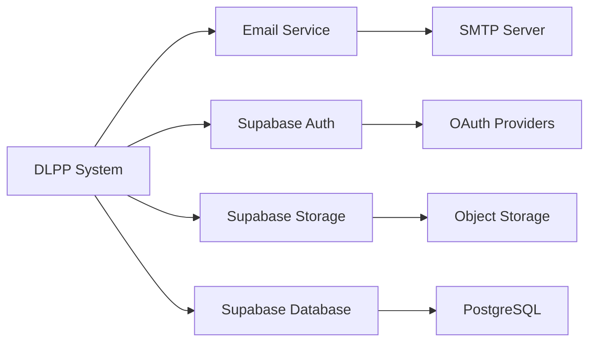

### 8.2 API Endpoints (Logical)

| Endpoint Category | Purpose | Methods |
|------------------|---------|---------|
| `/api/auth/*` | Authentication | POST, GET |
| `/api/cases/*` | Case management | GET, POST, PUT, DELETE |
| `/api/workflow/*` | Workflow operations | GET, POST, PUT |
| `/api/documents/*` | Document operations | GET, POST, DELETE |
| `/api/notifications/*` | Notification handling | GET, POST |
| `/api/reports/*` | Reporting | GET |
| `/api/admin/*` | Administration | GET, POST, PUT, DELETE |

---

## 9. Security Model

### 9.1 Security Layers

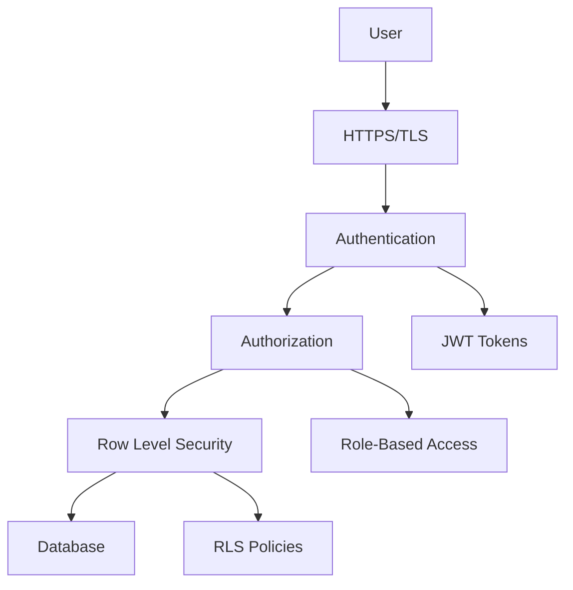

### 9.2 Security Mechanisms

| Layer | Mechanism | Implementation |
|-------|-----------|----------------|
| **Transport** | HTTPS/TLS | SSL certificates |
| **Authentication** | Session-based | Supabase Auth + JWT |
| **Authorization** | Role-based | User roles + permissions |
| **Data Access** | Row Level Security | PostgreSQL RLS policies |
| **File Security** | Signed URLs | Supabase Storage policies |
| **Audit** | Activity logging | case_history table |

---

## 10. Notification Model

### 10.1 Notification Types

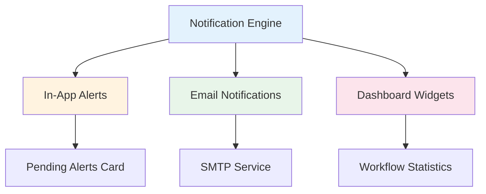

### 10.2 Alert Workflow

| Trigger | Notification Type | Recipients | Delivery Method |
|---------|------------------|------------|-----------------|
| Officer sends alert | In-app alert | Legal Manager, Secretary, Director | Dashboard + Email |
| Case deadline approaching | Task reminder | Assigned officer | Dashboard + Email |
| Document uploaded | Activity notification | Case stakeholders | Dashboard |
| Case status change | Status update | Case team | Dashboard |
| New case assigned | Assignment notice | Assigned officer | Dashboard + Email |

---

## 11. Reporting Model

### 11.1 Report Categories

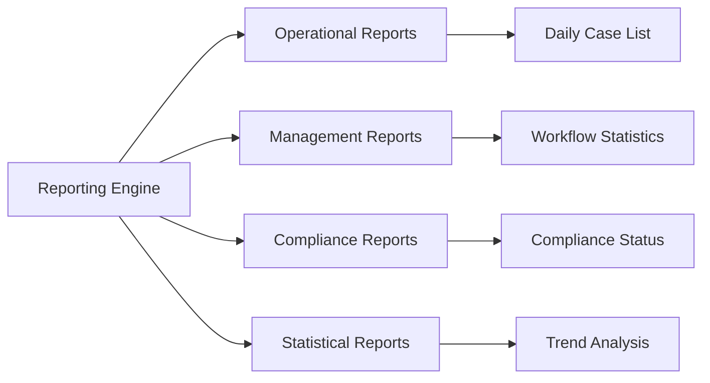

### 11.2 Key Reports

| Report | Purpose | Frequency | Users |
|--------|---------|-----------|-------|
| **Dashboard Statistics** | Real-time overview | Real-time | All users |
| **Workflow Progress** | Track case stages | Daily | Management |
| **Pending Alerts** | Alert monitoring | Real-time | Senior staff |
| **Case Aging Report** | Identify delays | Weekly | Management |
| **Compliance Status** | Court order tracking | Daily | Legal Manager |
| **Document Inventory** | File tracking | Monthly | Admin |
| **User Activity** | Audit log | On-demand | Admin |

---

## 12. Business Rules

### 12.1 Case Management Rules

1. **Case Number Generation**:
   - Format: `DLPP-YYYY-XXXXXX`
   - Automatically generated
   - Unique constraint enforced

2. **Case Registration**:
   - Minimum required: Title + DLPP Role + Originating Document
   - All other fields optional (progressive entry)
   - Document upload mandatory

3. **Case Status Progression**:
   - Must follow workflow sequence
   - Cannot skip steps
   - Can loop back to earlier steps from Compliance

4. **Document Management**:
   - All documents linked to cases
   - Maximum file size: 50MB
   - Allowed types: PDF, Word, Excel, Images
   - All uploads logged with timestamp and uploader

### 12.2 Workflow Rules

1. **Directions (Step 2)**:
   - Can be issued multiple times per case
   - Must specify source (Secretary/Director/Manager)
   - Can assign to specific officer
   - Can set priority and deadline

2. **Allocation (Step 3)**:
   - Requires direction reference
   - Must specify litigation officer
   - Can include detailed instructions
   - Can be reassigned

3. **Litigation (Step 4)**:
   - Only assigned officers can update
   - All filings must reference case
   - Documents linked to filings
   - Status updates logged

4. **Compliance (Step 5)**:
   - Can loop back to Steps 2 or 4
   - Tracks court order deadlines
   - Requires division assignment
   - Iterative until complete

5. **Closure (Step 6)**:
   - Requires outcome documentation
   - Must specify closure type
   - Auto-updates case status
   - Logs to history

6. **Notifications (Step 7)**:
   - Multiple notifications per case
   - Tracks proof of communication
   - Records delivery method
   - Logs recipient details

### 12.3 Alert System Rules

1. **Alert Creation**:
   - Available in Steps 2-6
   - Must select case first
   - Must choose recipient role
   - Must set priority level

2. **Alert Response**:
   - Only accessible to target role
   - Response marks alert as resolved
   - Original alert preserved
   - Response timestamps recorded

---

## 13. Data Validation Rules

### 13.1 Field Validations

| Field | Rule | Reason |
|-------|------|--------|
| Email | Valid email format | Authentication |
| Case Number | Unique, auto-generated | Identification |
| File Size | ≤ 50MB | Performance |
| File Type | PDF, Word, Excel, Image | Security |
| Date Fields | Valid date, not future (where applicable) | Data integrity |
| Status Values | From predefined list | Consistency |
| Phone Numbers | Valid format | Contact |

### 13.2 Business Validations

1. **User cannot**:
   - Edit cases not in their permission scope
   - Delete cases (admin only)
   - Access documents without case access
   - Skip workflow steps

2. **System enforces**:
   - Role-based access at database level
   - Unique case numbers
   - Required field validation
   - File type restrictions
   - Audit trail for all changes

---

## 14. Scalability Considerations

### 14.1 Logical Scalability

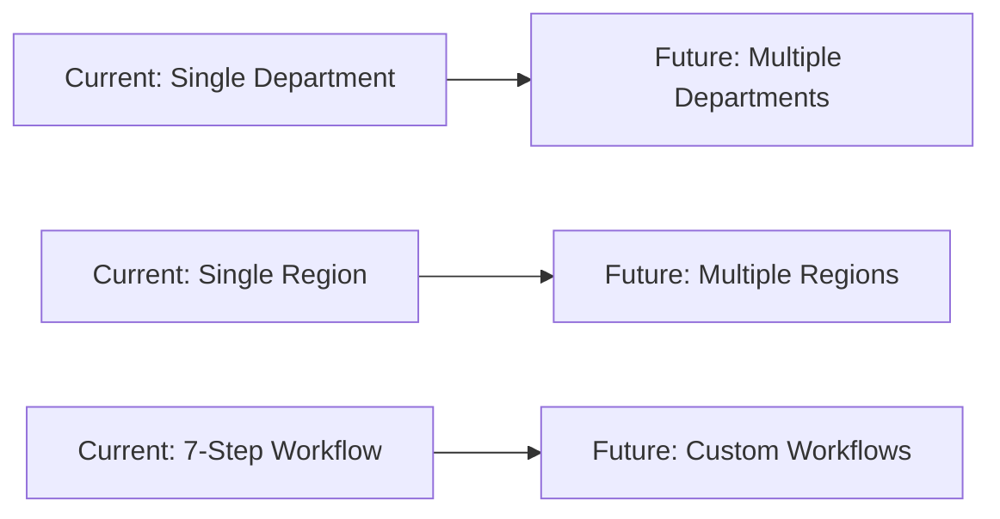

### 14.2 Extension Points

1. **Multi-tenancy**:
   - Department-level isolation
   - Shared infrastructure
   - Separate data spaces

2. **Workflow Customization**:
   - Configurable steps
   - Custom fields
   - Dynamic forms

3. **Integration**:
   - API expansion
   - Third-party connectors
   - Data export/import

---

## 15. Backup and Recovery (Logical)

### 15.1 Data Protection Strategy

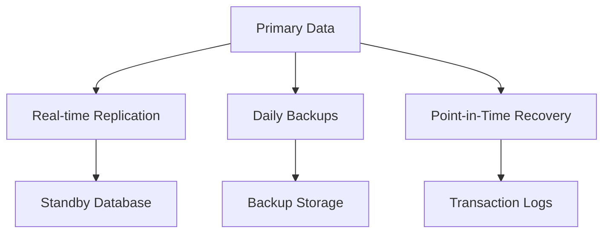

### 15.2 Recovery Objectives

| Metric | Target | Strategy |
|--------|--------|----------|
| **RTO** (Recovery Time) | < 1 hour | Automated failover |
| **RPO** (Recovery Point) | < 5 minutes | Continuous replication |
| **Backup Frequency** | Daily | Automated |
| **Backup Retention** | 30 days | Rolling window |

---

## 16. Performance Requirements

### 16.1 Response Time Targets

| Operation | Target | Acceptable |
|-----------|--------|------------|
| Page Load | < 2s | < 3s |
| Search Results | < 1s | < 2s |
| Document Upload | Progress bar | N/A |
| Report Generation | < 5s | < 10s |
| Dashboard Refresh | < 1s | < 2s |

### 16.2 Concurrent Users

- **Expected**: 50-100 concurrent users
- **Peak**: 200 concurrent users
- **Design Capacity**: 500 concurrent users

---

## 17. Compliance and Audit

### 17.1 Audit Trail

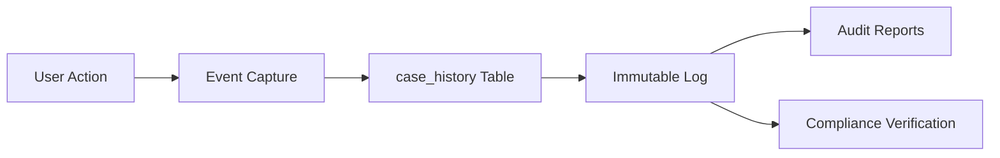

### 17.2 Logged Events

| Event Type | Information Captured |
|------------|---------------------|
| **Case Creation** | User, timestamp, initial data |
| **Case Update** | User, timestamp, changed fields |
| **Document Upload** | User, timestamp, file details |
| **Status Change** | User, timestamp, old/new status |
| **Assignment** | Assigner, assignee, timestamp |
| **Alert** | Sender, recipient, timestamp, response |
| **User Login** | User, timestamp, IP address |
| **Permission Change** | Admin, timestamp, changes |

---

## 18. Disaster Recovery

### 18.1 Recovery Scenarios

| Scenario | Impact | Recovery Procedure |
|----------|--------|-------------------|
| **Database Failure** | High | Failover to replica |
| **Storage Failure** | Medium | Restore from backup |
| **Application Failure** | Medium | Redeploy from GitHub |
| **Network Failure** | High | Route to backup network |
| **Data Corruption** | High | Point-in-time recovery |

---

## 19. System Boundaries

### 19.1 In Scope

✅ Case lifecycle management
✅ Document management
✅ Workflow automation
✅ User management
✅ Alert system
✅ Basic reporting
✅ Audit logging
✅ Role-based access

### 19.2 Out of Scope

❌ Financial management
❌ HR integration
❌ External court system integration
❌ Mobile application
❌ Advanced analytics/BI
❌ Email server hosting
❌ Physical document scanning

---

## 20. Success Metrics

### 20.1 Key Performance Indicators

| KPI | Measurement | Target |
|-----|-------------|--------|
| **System Availability** | Uptime % | > 99.5% |
| **User Adoption** | Active users % | > 80% |
| **Case Processing Time** | Average days | Reduce by 30% |
| **Document Retrieval** | Average time | < 10 seconds |
| **Alert Response Time** | Average hours | < 24 hours |
| **User Satisfaction** | Survey score | > 4/5 |

---

**Document Version**: 1.0
**Last Updated**: December 10, 2025
**Next Review**: March 10, 2026
**Owner**: DLPP IT Department
