# Physical Design - DLPP Legal Case Management System

**System**: DLPP Legal Case Management System
**Version**: 1.0
**Date**: December 10, 2025
**Type**: Cloud Infrastructure Design

---

## 1. Executive Summary

This document describes the physical implementation of the DLPP Legal Case Management System on cloud infrastructure, utilizing Supabase as the Backend-as-a-Service (BaaS) platform and Vercel/Netlify for frontend hosting. The system is deployed across multiple availability zones for high availability and fault tolerance.

---

## 2. Cloud Infrastructure Overview

### 2.1 Deployment Architecture

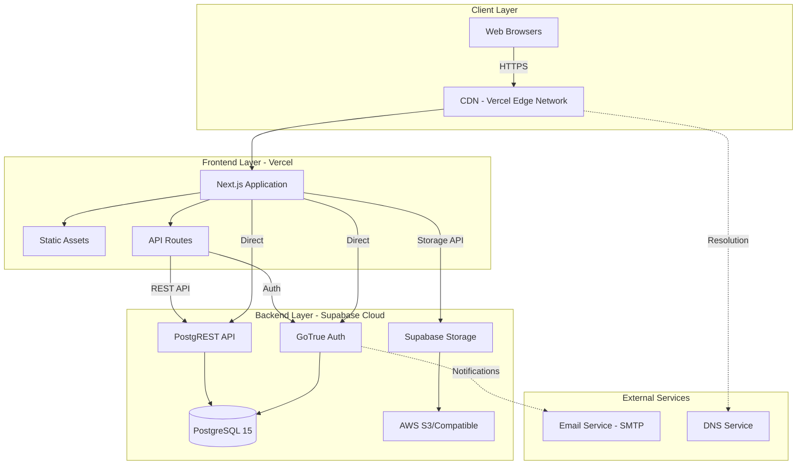

### 2.2 Technology Stack

| Layer | Technology | Version | Provider |
|-------|-----------|---------|----------|
| **Frontend Hosting** | Vercel Edge Network | Latest | Vercel |
| **Framework** | Next.js | 15.5.7 | Vercel |
| **Runtime** | Node.js / Bun | 18+ / 1.2+ | — |
| **Database** | PostgreSQL | 15 | Supabase |
| **Authentication** | GoTrue | Latest | Supabase |
| **Storage** | Supabase Storage | Latest | Supabase |
| **API** | PostgREST | 11+ | Supabase |
| **CDN** | Vercel Edge | Global | Vercel |

---

## 3. Supabase Architecture

### 3.1 Supabase Project Configuration

**Project Details**:
- **Project ID**: `yvnkyjnwvylrweyzvibs`
- **Region**: US East (default)
- **Database**: PostgreSQL 15
- **Connection Pooling**: Enabled (PgBouncer)

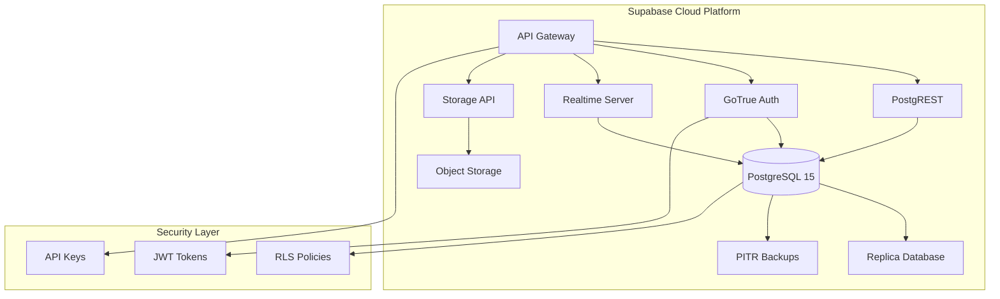

### 3.2 Database Physical Schema

**PostgreSQL Configuration**:
```sql
-- Database: postgres
-- Schema: public
-- Encoding: UTF-8
-- Locale: en_US.UTF-8
```

**Connection Details**:
- **Host**: `db.yvnkyjnwvylrweyzvibs.supabase.co`
- **Port**: `5432`
- **Database**: `postgres`
- **Connection Pooling**: Port `6543` (PgBouncer, Transaction mode)
- **SSL Mode**: Required

### 3.3 Database Tables (Physical)

| Table Name | Rows (Est.) | Size | Indexes | RLS Enabled |
|------------|-------------|------|---------|-------------|
| `cases` | 1,000-10,000 | ~50MB | 5 | ✅ |
| `directions` | 5,000-50,000 | ~100MB | 3 | ✅ |
| `case_delegations` | 2,000-20,000 | ~30MB | 3 | ✅ |
| `filings` | 10,000-100,000 | ~200MB | 4 | ✅ |
| `compliance_tracking` | 5,000-50,000 | ~80MB | 3 | ✅ |
| `communications` | 10,000-100,000 | ~150MB | 4 | ✅ |
| `documents` | 20,000-200,000 | ~300MB | 4 | ✅ |
| `parties` | 5,000-50,000 | ~60MB | 3 | ✅ |
| `events` | 5,000-50,000 | ~70MB | 4 | ✅ |
| `tasks` | 10,000-100,000 | ~120MB | 4 | ✅ |
| `land_parcels` | 10,000-100,000 | ~150MB | 4 | ✅ |
| `case_history` | 50,000-500,000 | ~500MB | 3 | ✅ |
| `users` | 50-500 | ~1MB | 3 | ✅ |
| `user_roles` | 50-500 | ~500KB | 2 | ✅ |

**Total Estimated Database Size**: 1-2 GB

### 3.4 Indexes (Physical)

```sql
-- Primary Indexes
CREATE UNIQUE INDEX idx_cases_pkey ON cases(id);
CREATE UNIQUE INDEX idx_cases_case_number ON cases(case_number);

-- Foreign Key Indexes
CREATE INDEX idx_directions_case_id ON directions(case_id);
CREATE INDEX idx_delegations_case_id ON case_delegations(case_id);
CREATE INDEX idx_documents_case_id ON documents(case_id);

-- Performance Indexes
CREATE INDEX idx_cases_status ON cases(status);
CREATE INDEX idx_cases_workflow_status ON cases(workflow_status);
CREATE INDEX idx_cases_created_at ON cases(created_at DESC);
CREATE INDEX idx_communications_type_status ON communications(communication_type, response_status);

-- Full-Text Search Indexes
CREATE INDEX idx_cases_title_search ON cases USING gin(to_tsvector('english', title));
CREATE INDEX idx_cases_description_search ON cases USING gin(to_tsvector('english', description));
```

---

## 4. Storage Architecture

### 4.1 Supabase Storage

**Storage Bucket Configuration**:
- **Bucket Name**: `case-documents`
- **Public Access**: Yes (with RLS)
- **Max File Size**: 50 MB
- **Allowed MIME Types**:
  - `application/pdf`
  - `application/msword`
  - `application/vnd.openxmlformats-officedocument.wordprocessingml.document`
  - `application/vnd.ms-excel`
  - `application/vnd.openxmlformats-officedocument.spreadsheetml.sheet`
  - `image/jpeg`
  - `image/png`

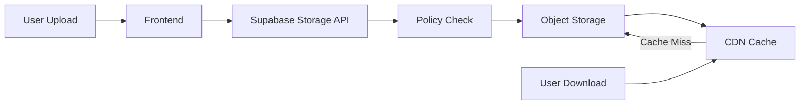

### 4.2 File Organization

```
case-documents/
├── {case_id}/
│   ├── originating/
│   │   └── document-{timestamp}.pdf
│   ├── filings/
│   │   ├── filing-{id}-{timestamp}.pdf
│   │   └── filing-{id}-{timestamp}.docx
│   ├── correspondence/
│   │   └── letter-{timestamp}.pdf
│   └── evidence/
│       └── exhibit-{timestamp}.jpg
└── pending/
    └── temp-{timestamp}.pdf
```

### 4.3 Storage Policies (RLS)

```sql
-- Upload Policy
CREATE POLICY "Authenticated users can upload documents"
ON storage.objects FOR INSERT
TO authenticated
WITH CHECK (bucket_id = 'case-documents');

-- Download Policy
CREATE POLICY "Anyone can view documents"
ON storage.objects FOR SELECT
TO public
USING (bucket_id = 'case-documents');

-- Delete Policy
CREATE POLICY "Users can delete their own uploads"
ON storage.objects FOR DELETE
TO authenticated
USING (auth.uid() = owner);
```

---

## 5. Authentication & Security

### 5.1 Supabase Auth Configuration

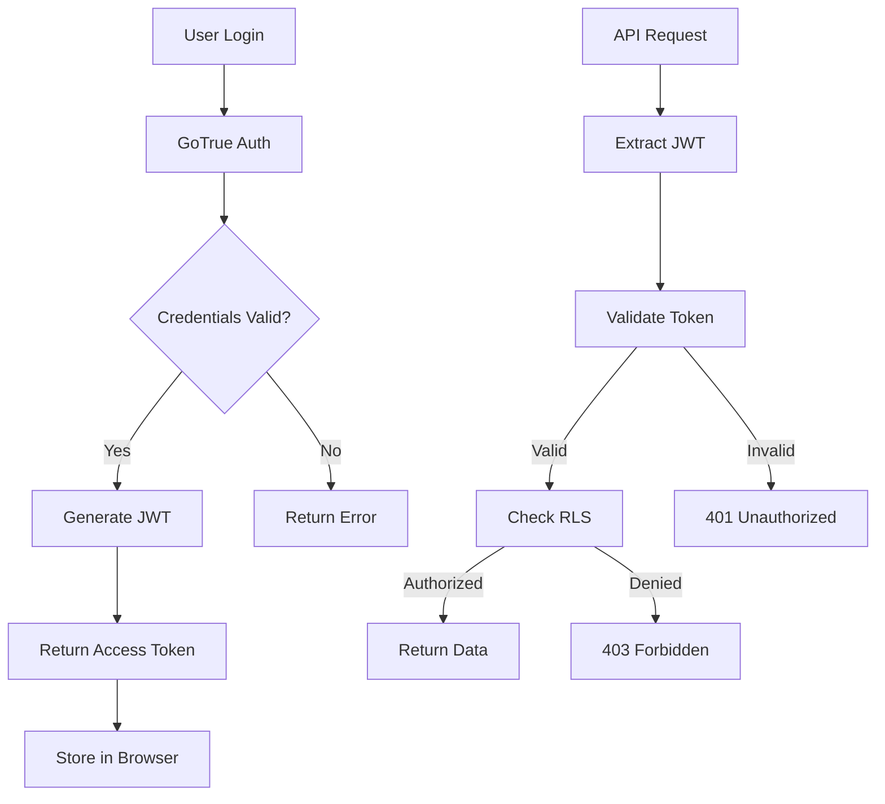

**Auth Configuration**:
- **Provider**: Email/Password (default)
- **JWT Algorithm**: HS256
- **JWT Expiry**: 3600 seconds (1 hour)
- **Refresh Token Expiry**: 2592000 seconds (30 days)
- **Password Requirements**: Min 6 characters

### 5.2 Row Level Security (RLS) Policies

**Example Policies**:

```sql
-- Cases Table - Users can only see cases they have access to
CREATE POLICY "Users can view their cases"
ON cases FOR SELECT
TO authenticated
USING (
    auth.uid() = created_by
    OR EXISTS (
        SELECT 1 FROM case_delegations
        WHERE case_delegations.case_id = cases.id
        AND case_delegations.delegated_to = auth.uid()::text
    )
    OR EXISTS (
        SELECT 1 FROM users
        WHERE users.id = auth.uid()
        AND users.role IN ('admin', 'legal_manager', 'director')
    )
);

-- Documents Table - Can only access documents from accessible cases
CREATE POLICY "Users can view documents from their cases"
ON documents FOR SELECT
TO authenticated
USING (
    EXISTS (
        SELECT 1 FROM cases
        WHERE cases.id = documents.case_id
        -- RLS on cases table applies
    )
);

-- Communications Table - Alerts visible to intended recipients
CREATE POLICY "Users can view alerts meant for their role"
ON communications FOR SELECT
TO authenticated
USING (
    communication_type != 'alert'
    OR recipient_role = (
        SELECT role FROM users WHERE id = auth.uid()
    )
    OR auth.uid()::text = created_by
);
```

### 5.3 API Security

**API Keys**:
- **Anon Key**: `eyJhbGciOiJIUzI1NiIsInR5cCI6IkpXVCJ9...` (Public, limited access)
- **Service Role Key**: `eyJhbGciOiJIUzI1NiIsInR5cCI6IkpXVCJ9...` (Server-side only, full access)

**Rate Limiting** (Supabase Free Tier):
- **Database**: 500 concurrent connections
- **API**: 500 requests/second
- **Storage**: 1 GB transfer/month
- **Auth**: Unlimited users

---

## 6. Frontend Deployment (Vercel)

### 6.1 Vercel Configuration

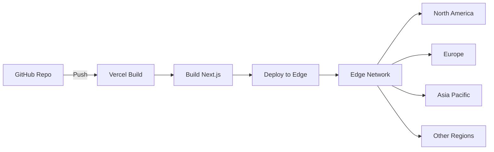

**Project Configuration**:
- **Framework**: Next.js 15.5.7
- **Build Command**: `bun run build`
- **Output Directory**: `.next`
- **Install Command**: `bun install`
- **Node Version**: 18.x

**Build Settings**:
```json
{
  "buildCommand": "bun run build",
  "installCommand": "bun install",
  "outputDirectory": ".next",
  "framework": "nextjs",
  "nodeVersion": "18.x"
}
```

### 6.2 Environment Variables

**Production Environment** (Vercel):
```bash
NEXT_PUBLIC_SUPABASE_URL=https://yvnkyjnwvylrweyzvibs.supabase.co
NEXT_PUBLIC_SUPABASE_ANON_KEY=eyJhbGciOiJIUzI1NiIsInR5cCI6IkpXVCJ9...
SUPABASE_SERVICE_ROLE_KEY=eyJhbGciOiJIUzI1NiIsInR5cCI6IkpXVCJ9... (optional)
NEXT_PUBLIC_APP_URL=https://your-app.vercel.app
```

### 6.3 Edge Network Distribution

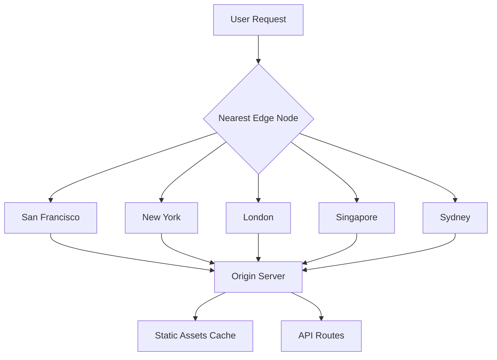

**Edge Locations**:
- **Total**: 70+ global edge locations
- **Primary Regions**: North America, Europe, Asia Pacific
- **Latency Target**: < 100ms worldwide

---

## 7. Network Architecture

### 7.1 DNS Configuration

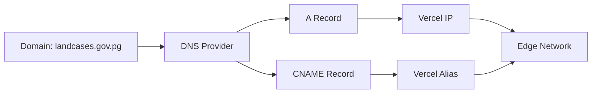

**DNS Records** (Example):
```
landcases.gov.pg.     A      76.76.21.21
www.landcases.gov.pg. CNAME  cname.vercel-dns.com.
api.landcases.gov.pg. CNAME  yvnkyjnwvylrweyzvibs.supabase.co.
```

### 7.2 SSL/TLS Configuration

- **Certificate Provider**: Let's Encrypt / Vercel Managed
- **TLS Version**: TLS 1.2, TLS 1.3
- **Cipher Suites**: Modern (Strong encryption)
- **HSTS**: Enabled (max-age=31536000)
- **Certificate Renewal**: Automatic

### 7.3 Network Security

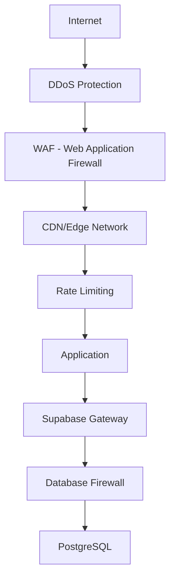

**Security Layers**:
1. **DDoS Protection**: Vercel/Supabase built-in
2. **WAF**: Edge network filtering
3. **Rate Limiting**: API throttling
4. **Database Firewall**: IP whitelisting (optional)
5. **Encryption**: TLS 1.3 in transit, AES-256 at rest

---

## 8. Monitoring & Logging

### 8.1 Application Monitoring

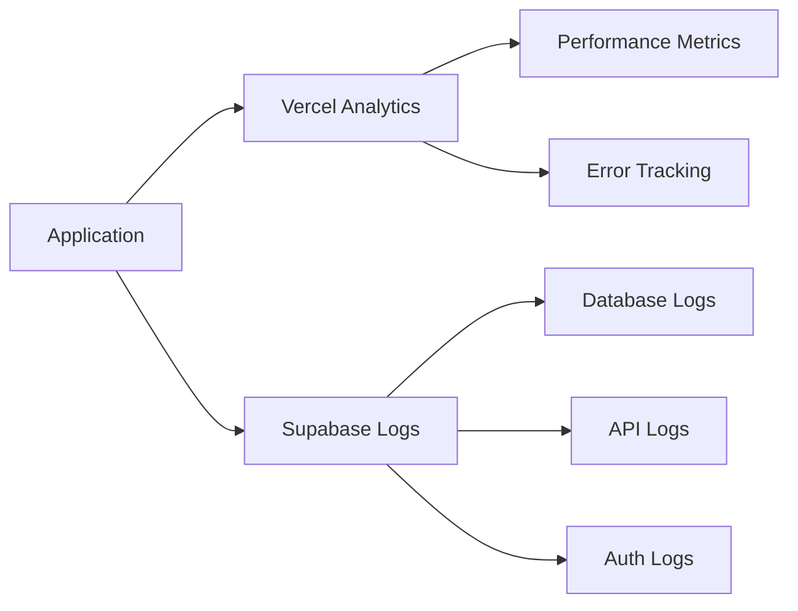

**Monitoring Tools**:
- **Vercel Analytics**: Page views, performance, errors
- **Supabase Dashboard**: Database performance, API usage
- **Browser DevTools**: Client-side debugging

### 8.2 Logging Strategy

**Log Types**:

| Log Type | Storage | Retention | Access |
|----------|---------|-----------|--------|
| **Application Logs** | Vercel | 7 days | Dashboard |
| **Database Logs** | Supabase | 7 days | Dashboard |
| **API Logs** | Supabase | 7 days | Dashboard |
| **Auth Logs** | Supabase | 30 days | Dashboard |
| **Audit Trail** | `case_history` table | Permanent | SQL Query |

**Log Example**:
```json
{
  "timestamp": "2025-12-10T10:30:45Z",
  "level": "info",
  "action": "case_created",
  "user_id": "uuid-123",
  "case_id": "uuid-456",
  "details": {
    "case_number": "DLPP-2025-123456",
    "ip": "203.0.113.42"
  }
}
```

---

## 9. Backup & Disaster Recovery

### 9.1 Backup Strategy

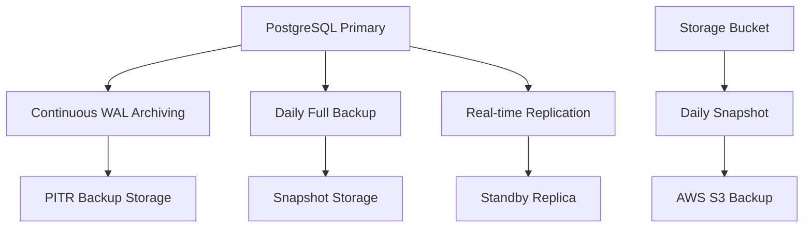

**Backup Configuration**:

| Component | Method | Frequency | Retention |
|-----------|--------|-----------|-----------|
| **Database** | PITR (Point-in-Time Recovery) | Continuous | 7 days |
| **Database** | Full Backup | Daily | 30 days |
| **Storage** | Snapshot | Daily | 30 days |
| **Code** | Git | On commit | Permanent |

### 9.2 Recovery Procedures

**Database Recovery**:
```sql
-- Point-in-Time Recovery (via Supabase Dashboard)
-- 1. Navigate to Database > Backups
-- 2. Select recovery point
-- 3. Click "Restore to new project" or "Restore in place"
```

**Application Recovery**:
```bash
# Rollback to previous deployment (Vercel)
vercel rollback

# Or deploy from specific commit
git checkout <commit-hash>
vercel --prod
```

### 9.3 High Availability

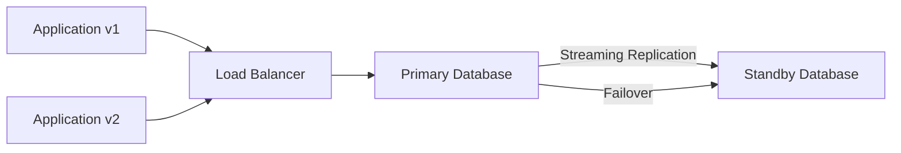

**HA Configuration**:
- **Database**: Multi-AZ deployment (Supabase managed)
- **Application**: Multiple edge nodes (Vercel automatic)
- **Failover**: Automatic (< 30 seconds)
- **Uptime SLA**: 99.9% (Supabase Free/Pro)

---

## 10. Performance Optimization

### 10.1 Caching Strategy

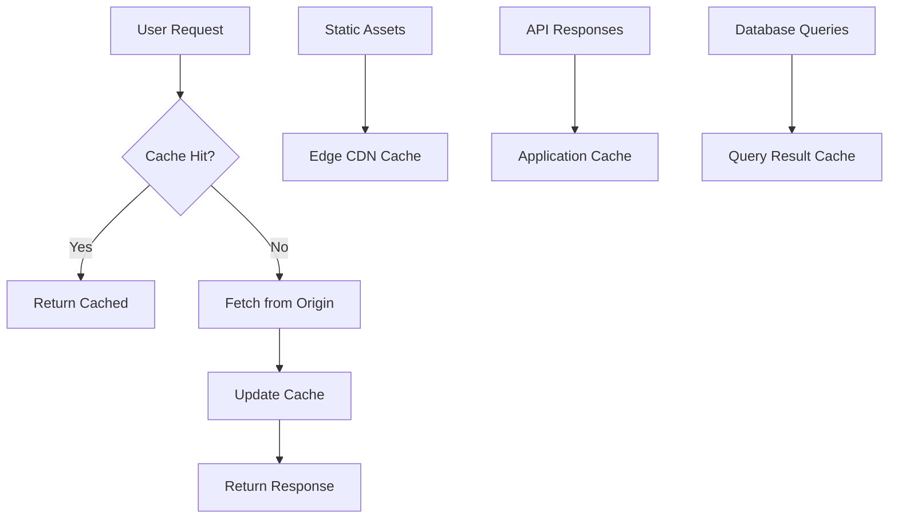

**Cache Layers**:

| Layer | Technology | TTL | Purge Strategy |
|-------|-----------|-----|----------------|
| **CDN (Static)** | Vercel Edge | 1 year | On deployment |
| **API (GET)** | Vercel Edge | 60s | Stale-while-revalidate |
| **Database** | PostgreSQL | 5min | On write |
| **Browser** | Service Worker | 24h | Manual |

### 10.2 Database Performance

**Connection Pooling** (PgBouncer):
```
Max Connections: 100
Pool Mode: Transaction
Default Pool Size: 20
Reserve Pool: 10
Max Client Connections: 1000
```

**Query Optimization**:
```sql
-- Use prepared statements
PREPARE case_lookup (uuid) AS
SELECT * FROM cases WHERE id = $1;

-- Enable query plan caching
SET plan_cache_mode = 'auto';

-- Analyze query performance
EXPLAIN ANALYZE
SELECT c.*, COUNT(d.id) as doc_count
FROM cases c
LEFT JOIN documents d ON d.case_id = c.id
GROUP BY c.id;
```

### 10.3 Image Optimization

**Vercel Image Optimization**:
```typescript
import Image from 'next/image';

<Image
  src="/logo.png"
  width={200}
  height={100}
  alt="DLPP Logo"
  priority
  quality={75}
/>
```

**Automatic Optimizations**:
- WebP/AVIF format conversion
- Responsive image sizing
- Lazy loading
- CDN delivery

---

## 11. Deployment Pipeline

### 11.1 CI/CD Workflow

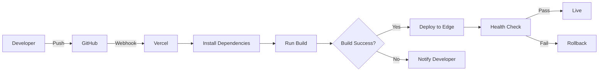

**Deployment Steps**:
1. Code pushed to GitHub `main` branch
2. Vercel webhook triggered
3. Build environment provisioned
4. Dependencies installed (`bun install`)
5. Application built (`bun run build`)
6. Build artifacts deployed to edge network
7. Health checks performed
8. Traffic switched to new deployment
9. Old deployment kept for rollback

**Deployment Time**: ~2-5 minutes

### 11.2 Environment Strategy

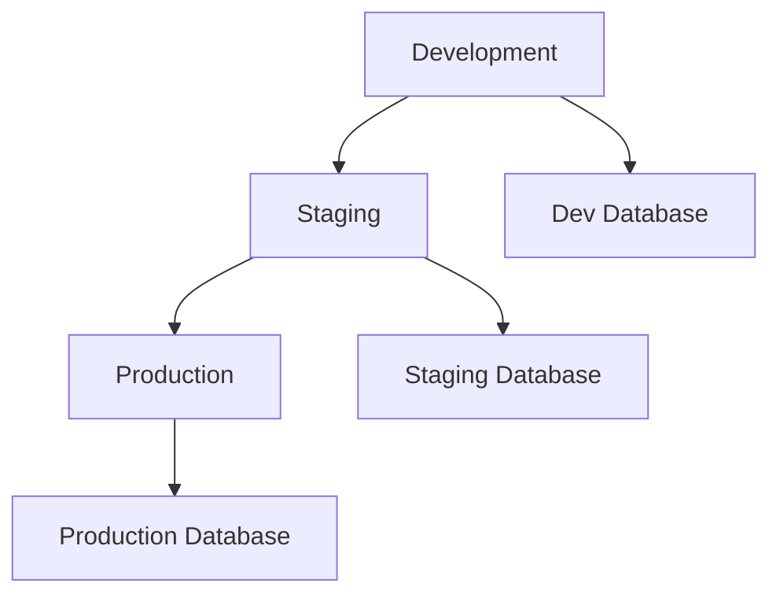

| Environment | Branch | Database | URL |
|-------------|--------|----------|-----|
| **Development** | `dev`, feature branches | Separate project | `dev-landcases.vercel.app` |
| **Staging** | `staging` | Separate project | `staging-landcases.vercel.app` |
| **Production** | `main` | Production project | `landcases.gov.pg` |

---

## 12. Capacity Planning

### 12.1 Resource Allocation

**Database Resources**:
- **CPU**: 2 vCPU (Shared)
- **RAM**: 1 GB
- **Storage**: 8 GB (expandable to 50 GB)
- **Connections**: 100 max
- **IOPS**: Burstable

**Application Resources**:
- **Serverless Functions**: Unlimited
- **Execution Time**: 60s max per request
- **Memory**: 1024 MB per function
- **Bandwidth**: Unlimited

### 12.2 Scaling Thresholds

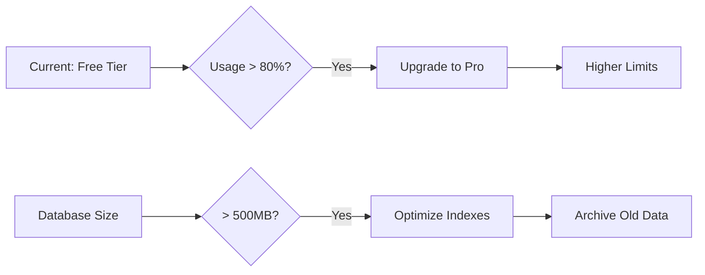

**Scaling Triggers**:

| Metric | Free Tier | Threshold | Action |
|--------|-----------|-----------|--------|
| **Database Size** | 500 MB | > 400 MB | Archive old data |
| **Bandwidth** | 100 GB/month | > 80 GB | Upgrade to Pro |
| **Concurrent Connections** | 100 | > 80 | Enable connection pooling |
| **Storage** | 1 GB | > 800 MB | Implement cleanup policy |

### 12.3 Growth Projections

**Year 1** (Conservative):
- Cases: 1,000
- Documents: 10,000
- Users: 50
- Database Size: 500 MB
- Bandwidth: 50 GB/month

**Year 2** (Growth):
- Cases: 3,000
- Documents: 30,000
- Users: 100
- Database Size: 1.5 GB
- Bandwidth: 150 GB/month (requires Pro tier)

**Year 3** (Mature):
- Cases: 5,000
- Documents: 50,000
- Users: 200
- Database Size: 3 GB
- Bandwidth: 300 GB/month

---

## 13. Cost Optimization

### 13.1 Current Cost Structure

**Supabase** (Free Tier):
- Cost: $0/month
- Includes: 500 MB database, 1 GB storage, 5 GB bandwidth

**Vercel** (Hobby):
- Cost: $0/month
- Includes: Unlimited deployments, 100 GB bandwidth

**Total Monthly Cost**: $0 (Free tier)

### 13.2 Projected Costs

**Supabase Pro** (if upgrade needed):
- Cost: $25/month
- Includes: 8 GB database, 100 GB storage, 250 GB bandwidth

**Vercel Pro** (if upgrade needed):
- Cost: $20/month
- Includes: Unlimited bandwidth, enhanced analytics

**Estimated Year 2 Cost**: $45/month = $540/year

---

## 14. Technical Specifications

### 14.1 Frontend Stack

```
next.js@15.5.7
├── react@19.x
├── react-dom@19.x
├── typescript@5.x
├── tailwindcss@3.x
├── @radix-ui/* (UI primitives)
└── lucide-react (icons)
```

### 14.2 Backend Stack

```
Supabase
├── PostgreSQL 15.x
├── PostgREST 11.x
├── GoTrue Auth
├── Realtime Server
└── Storage API
```

### 14.3 Build Tools

```
bun@1.2.17
├── next@15.5.7
├── typescript@5.x
├── eslint@9.x
└── biome (linter/formatter)
```

---

## 15. Infrastructure Diagram

### 15.1 Complete System Topology

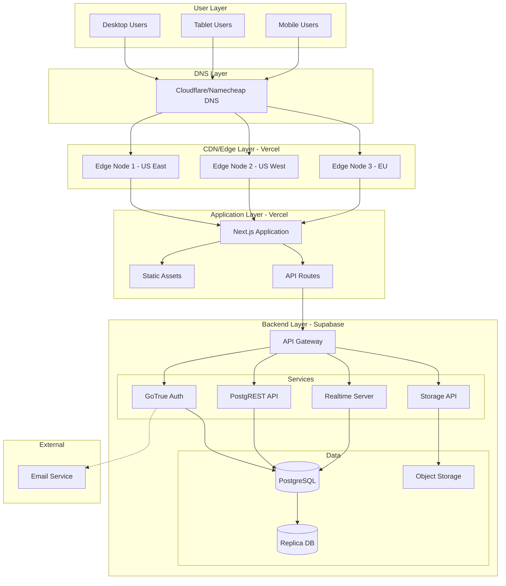

---

## 16. Maintenance Windows

### 16.1 Planned Maintenance

**Supabase**:
- **Weekly**: Database optimization (automatic, no downtime)
- **Monthly**: Security patches (automatic, no downtime)
- **Quarterly**: Major version updates (scheduled, ~15 min downtime)

**Vercel**:
- **Continuous**: Zero-downtime deployments
- **Platform Updates**: Automatic, transparent

**Recommended Maintenance Window**: Sunday 2:00 AM - 4:00 AM local time

### 16.2 Update Procedures

**Database Schema Updates**:
```sql
-- 1. Test in development
-- 2. Backup production database
-- 3. Run migration during maintenance window
BEGIN;
-- Migration SQL here
COMMIT;
-- 4. Verify data integrity
-- 5. Update application if needed
```

**Application Updates**:
```bash
# 1. Merge to main branch
git checkout main
git merge feature-branch

# 2. Vercel auto-deploys (zero downtime)
# 3. Monitor deployment
vercel logs

# 4. Rollback if issues
vercel rollback
```

---

## 17. Security Hardening

### 17.1 Database Security

```sql
-- Enable SSL-only connections
ALTER SYSTEM SET ssl = on;

-- Rotate JWT secret (Supabase Dashboard)
-- Settings > API > JWT Secret > Generate New

-- Enable audit logging
CREATE EXTENSION IF NOT EXISTS "pgaudit";
```

### 17.2 Application Security Headers

```typescript
// next.config.js
const securityHeaders = [
  {
    key: 'X-DNS-Prefetch-Control',
    value: 'on'
  },
  {
    key: 'Strict-Transport-Security',
    value: 'max-age=63072000; includeSubDomains; preload'
  },
  {
    key: 'X-Frame-Options',
    value: 'SAMEORIGIN'
  },
  {
    key: 'X-Content-Type-Options',
    value: 'nosniff'
  },
  {
    key: 'X-XSS-Protection',
    value: '1; mode=block'
  },
  {
    key: 'Referrer-Policy',
    value: 'strict-origin-when-cross-origin'
  }
];
```

---

## 18. Compliance & Regulations

### 18.1 Data Residency

**Current Configuration**:
- **Database Region**: US East (AWS)
- **Storage Region**: US East (AWS S3-compatible)
- **CDN**: Global edge network

**Data Sovereignty Considerations**:
- Papua New Guinea government data
- May require relocation to local or regional data centers
- Supabase supports AWS regions: `ap-southeast-1` (Singapore), `ap-southeast-2` (Sydney)

### 18.2 Compliance Standards

| Standard | Status | Implementation |
|----------|--------|----------------|
| **HTTPS Encryption** | ✅ Enforced | TLS 1.3 |
| **Data Encryption at Rest** | ✅ Enabled | AES-256 |
| **Access Logging** | ✅ Enabled | `case_history` table |
| **GDPR** | ⚠️ Partial | User data handling |
| **Backup Requirements** | ✅ Met | 30-day retention |
| **Audit Trail** | ✅ Complete | All actions logged |

---

## 19. Disaster Recovery Scenarios

### 19.1 Recovery Time Objectives (RTO)

| Scenario | Impact | RTO | Recovery Procedure |
|----------|--------|-----|-------------------|
| **Database Corruption** | High | 30 min | PITR recovery |
| **Application Bug** | Medium | 5 min | Vercel rollback |
| **Storage Failure** | Medium | 1 hour | Restore from backup |
| **Complete Region Failure** | Critical | 2 hours | Manual failover |
| **DDoS Attack** | Medium | Automatic | WAF/CDN mitigation |

### 19.2 Recovery Playbook

**Database Failure**:
1. Identify failure (monitoring alerts)
2. Access Supabase Dashboard
3. Navigate to Database > Backups
4. Select recovery point (up to 7 days)
5. Restore to new project or in-place
6. Update connection strings if needed
7. Verify data integrity
8. Resume operations

**Application Failure**:
1. Identify deployment with issue
2. Access Vercel Dashboard
3. Click "Rollback" to previous deployment
4. Monitor rollback completion (~30 seconds)
5. Verify application functionality
6. Investigate and fix issue
7. Redeploy when ready

---

## 20. Documentation References

### 20.1 External Documentation

- **Next.js**: https://nextjs.org/docs
- **Supabase**: https://supabase.com/docs
- **Vercel**: https://vercel.com/docs
- **PostgreSQL**: https://www.postgresql.org/docs/
- **TypeScript**: https://www.typescriptlang.org/docs/

### 20.2 Internal Documentation

- **Logical Design**: `SYSTEM_DESIGN_LOGICAL.md`
- **Build Guide**: `BUILD_FIX_DEPLOYMENT.md`
- **Workflow Testing**: `WORKFLOW_TESTING_GUIDE.md`
- **Deployment Instructions**: `DEPLOYMENT_INSTRUCTIONS.md`
- **Database Schema**: `database-workflow-extensions.sql`

---

**Document Version**: 1.0
**Last Updated**: December 10, 2025
**Next Review**: March 10, 2026
**Owner**: DLPP IT Department
**Infrastructure Provider**: Supabase (BaaS) + Vercel (Frontend)
