# DLPP Legal Case Management System — System Process Flow

**Department of Lands & Physical Planning (DLPP)**
End-to-end process flow from case intake to closure, mapped directly to the application's modules, routes, and database tables.

> This document was produced from a full source-code review of the live application. Every stage below references the actual page/route, the handler that performs the work, and the Supabase tables written. Where two implementations exist for the same feature, the **primary (sidebar-linked)** path is marked.

---

## 1. Purpose & Scope

The system manages the full lifecycle of a litigation/legal case for DLPP — from the moment a court document (or internal matter) is received, through registration, officer assignment, active litigation, judgment, compliance, and finally formal closure and archiving.

The application is a **Next.js 15 (App Router)** front end with a **Supabase (PostgreSQL + Auth + Storage)** back end. Data is written in two ways:

- **Direct Supabase client calls** (`src/lib/supabase.ts`) — used by most interactive pages/dialogs.
- **Next.js API routes** (`src/app/api/**`) — used where a service-role key is needed (case registration, user administration, allocation, filings, compliance links, dashboard stats).

---

## 2. Actors / Roles

Roles are stored on `profiles.role` and drive both server-side checks and (via RBAC) sidebar visibility.

| Role | Primary responsibility in the flow |
|------|-------------------------------------|
| Para-Legal / Registry Officer | Receives documents, **registers** cases |
| Manager Legal Services / Senior Legal Officer | **Assigns / allocates** cases to action officers |
| Action Officer (Litigation Lawyer) | Works the case: directions, filings, documents, tasks, costs |
| Compliance Officer / Division | Tracks court-order **compliance** |
| Admin / Super Admin | User & RBAC administration, master data, oversight |

Access to each module is controlled by RBAC tables: `modules`, `groups`, `group_module_permissions`, `user_groups`. The sidebar (`src/components/layout/Sidebar.tsx`) only shows modules the signed-in user has read permission for (`getReadableModuleKeys()`).

---

## 3. High-Level Lifecycle (8 canonical stages)

Defined in `src/components/dashboard/WorkflowStepper.tsx` and rendered on every case detail page:

```
1. Registered  →  2. Assigned  →  3. In Progress  →  4. Directions
        →  5. Hearing  →  6. Judgment  →  7. Compliance  →  8. Closed
```

| # | Stage | Meaning | Driven by `cases.status` value(s) |
|---|-------|---------|-----------------------------------|
| 1 | Registered | Case filed and logged | `registered`, `under_review` |
| 2 | Assigned | Officer assigned | `assigned` |
| 3 | In Progress | Active litigation | `in_progress` |
| 4 | Directions | Court directions received | `in_court`, `directions` |
| 5 | Hearing | Hearing / mediation / tribunal | `hearing`, `mediation`, `tribunal` |
| 6 | Judgment | Court order issued | `judgment` |
| 7 | Compliance | Order compliance tracked | `compliance` |
| 8 | Closed | Case archived | `settled`, `closed` |

The `cases` table also carries a coarser `workflow_status` (e.g. `registered`) written by the registration API.

---

## 4. End-to-End Flow Diagram

```mermaid
flowchart TD
    A[Document / Matter received] --> B{Entry point}
    B -->|Registry desk| R1[Reception Intake<br/>/reception]
    B -->|Direct registration| REG

    R1 --> REG[Register Case<br/>/cases/new]
    REG -->|POST /api/cases/register| DBREG[(cases + parties + land_parcels<br/>+ calendar_events + tasks<br/>+ documents + case_history)]
    DBREG --> NOTIF1[[Notify Managers]]

    NOTIF1 --> ASSIGN[Assignment Inbox<br/>/cases/assignments]
    ASSIGN -->|assign officer| DBASSIGN[(cases.assigned_officer_id = officer<br/>status = assigned<br/>+ case_assignments + case_history)]
    DBASSIGN --> NOTIF2[[Notify Officer]]

    NOTIF2 --> HUB[Case Workspace Hub<br/>/cases/&#91;id&#93;]

    HUB --> M1[Parties]
    HUB --> M2[Documents]
    HUB --> M3[Tasks]
    HUB --> M4[Events / Calendar]
    HUB --> M5[Directions & Hearings]
    HUB --> M6[Correspondence / Communications]
    HUB --> M7[File Requests]
    HUB --> M8[Land Parcels]
    HUB --> M9[Lawyers]
    HUB --> M10[Litigation Costs]

    M5 --> HEAR[Hearings progressed]
    HEAR --> JUDG[Judgment / Court Order<br/>Court Order tab]
    JUDG -->|AddCourtOrderDialog| DBCO[(court_orders)]

    DBCO --> COMP[Compliance Tracking<br/>/compliance-tracking]
    COMP --> DBCOMP[(compliance_tracking)]

    DBCOMP --> CLOSE[Case Closure<br/>Closure tab]
    CLOSE -->|CaseClosureDialog| DBCLOSE[(cases.status = closed<br/>+ case_closures + case_history)]
    DBCLOSE --> DONE([Case Archived / Complete])

    HUB -.rolls up to.-> DASH[Dashboard & Reports]
    DBCLOSE -.rolls up to.-> DASH
```



---

## 5. Stage-by-Stage Module Flow

### 5.0 (Optional) Reception / Intake — `/reception`
- **Purpose:** Log an incoming court document *before* it becomes a full case.
- **Route/handler:** `/reception/list` → `POST /api/reception/register` (service role) → `incoming_correspondence`.
- **Next step:** From the registry, the matter is registered as a case.

### 5.1 Case Registration — `/cases/new`  *(Sidebar → Case Workflow → Register Case)*
- **Who:** Para-Legal / Registry Officer.
- **Handler:** Form submits to `POST /api/cases/register/route.ts` (uses the service-role key so registration always succeeds regardless of RLS).
- **What it creates (single transaction of best-effort inserts):**
  1. `cases` — core record. Auto-generates `case_number` (`LIT-<year>-<6digits>`) and `title` if blank. Sets `status` (default `under_review`), `priority`, `case_type`, `workflow_status = registered`.
  2. `parties` — inserts **DLPP** as plaintiff/defendant, and extracts the **opposing party** from the "A -v- B" description.
  3. `land_parcels` — if land details supplied.
  4. `calendar_events` — a hearing event if a *returnable date* is supplied (`auto_created = true`).
  5. `tasks` — an assignment task if an action officer is named.
  6. `documents` — a full metadata snapshot of the registration form (so no field is ever lost).
  7. `case_history` — `action = case_registered`, `workflow_state_to = REGISTERED`.
  8. `notifications` — to all `manager_legal_services` / `senior_legal_officer_litigation` users: *"New Case Registered – Awaiting Assignment."*
- **On success:** redirects to the case hub `/cases/[id]`.
- **Result state:** `status = under_review`/`registered`, `workflow_status = registered`, `assigned_officer_id = null`.

### 5.2 Assignment / Allocation — `/cases/assignments`  *(Sidebar → Case Workflow → Assignment Inbox)*
- **Who:** Manager / Senior Legal Officer.
- **Inbox query:** lists all `cases` where `assigned_officer_id IS NULL` (i.e., awaiting assignment), plus available officers from `profiles` (active, litigation/senior/admin roles).
- **Handler (`handleAssignCase`, direct Supabase):**
  1. Updates `cases` → `assigned_officer_id = officer`, `status = assigned`.
  2. Inserts `case_assignments` (audit — best-effort).
  3. Inserts `case_history` — *"Case Assigned"*.
- **Result state:** `status = assigned` (Stage 2). Officer is notified.
- **Consolidation note:** A second, unlinked allocation screen (`/allocation`) plus its API routes (`/api/cases/{search,assign-officer,assign,assignment-status}`, `/api/officers/available`) previously duplicated this flow. They were **removed** so `/cases/assignments` is now the single assignment path.

### 5.3 Active Litigation — the Case Workspace Hub — `/cases/[id]`
The single most important screen. It loads the case plus **parties, documents, tasks, events, land parcels, case history, alerts (communications), and court orders** in parallel, renders the **Workflow Stepper** — with an inline **"Update stage"** control that moves the case through Registered → Assigned → In Progress → Directions → Hearing → Judgment → Compliance (writing a `case_history` entry each time) — and exposes **12 tabs**. Every tab's Add/Edit/Delete is wired to a real dialog performing Supabase writes.

| Tab | Module purpose | Tables written | Related full-page module |
|-----|----------------|----------------|--------------------------|
| Overview | Snapshot + timeline | — (reads) | — |
| Parties | Plaintiffs, defendants, entities | `parties` | — |
| Documents | Upload / print / delete files | `documents` + Storage `case-documents` | `/documents` |
| Tasks | Action items & due dates | `tasks` | `/tasks` |
| Events | Hearings & key dates | `calendar_events` | `/calendar` |
| Land | Associated parcels | `land_parcels` | `/land-parcels` |
| Costs | Legal fees, penalties, settlements | `litigation_costs` (+ `cost_categories`, docs) | `/litigation-costs` |
| Court Order | **Judgment registration** | `court_orders` | — |
| Closure | **Finalize & archive** | `cases`, `case_closures`, `case_history` | — |
| Alerts | Requests for advice/direction + responses | `communications` (`communication_type = alert`) | `/communications` |
| Compliance | Linked recommendations | `compliance_tracking` links | `/compliance` |
| History | Full audit timeline | `case_history` (reads) | — |

Supporting stand-alone modules used during active litigation (all sidebar-linked):

- **Directions & Hearings — `/directions`** → `directions` table. Records court directions and moves the matter toward hearings (stages 4–5).
- **Correspondence — `/correspondence`** → `incoming_correspondence`; **Communications — `/communications`** → `communications`; **File Requests — `/file-requests`** → `file_requests`.
- **Lawyers — `/lawyers`** → `external_lawyers` (opposing counsel, Sol-Gen officers).
- **Filings — `/filings`** and the litigation drafting workspace **`/litigation/filings/[caseId]`** → `POST /api/filings/create` and `POST /api/filings/submit-for-review` → `filings` table (draft → submitted-for-review → filed).
- **Litigation Costs — `/litigation-costs`** → `litigation_costs`, `cost_categories`, `litigation_cost_documents`, `litigation_cost_history`.

### 5.4 Judgment / Court Order — Case hub → **Court Order** tab
- **Handler:** `AddCourtOrderDialog` → `court_orders` (reference, order date, judge, order type, terms, grounds, outcome, signed-order upload).
- **Outcome values:** `in_favor_dlpp`, `against_dlpp`, partial/mixed, etc.
- **Result state:** case advances to `judgment` (Stage 6).

### 5.5 Compliance Tracking — `/compliance-tracking` (+ `/compliance`)
- **Purpose:** Track that the parties/divisions comply with the court order.
- **Tables:** `compliance_tracking` (court-order reference, responsible division, memo references, deadline, status, completion date). Recommendations can be linked to a case via `POST /api/compliance/link` (used by `LinkRecommendationDialog` / `LinkedRecommendations`, surfaced in the hub's Compliance tab).
- **Result state:** `compliance` (Stage 7).

### 5.6 Case Closure — Case hub → **Closure** tab
- **Who:** Action Officer / Manager.
- **Handler:** `CaseClosureDialog` (direct Supabase) with a **pre-closure checklist** (judgment registered, compliance complete, documents archived, costs finalized) and a confirmation step:
  1. Updates `cases` → `status = closed`.
  2. Inserts `case_closures` (closure status, outcome, archive location — best-effort).
  3. Inserts `case_history` — *"Case Closed"*.
- **Result state:** `status = closed` (Stage 8). The Closure tab then shows the read-only "Case Closed / Archived" panel and further edits are blocked without admin approval.

---

## 6. Cross-Cutting Concerns

- **Notifications** (`notifications` table): generated on registration (to managers) and assignment (to the officer); surfaced at `/notifications` and in the top-bar Notification Center.
- **Audit trail** (`case_history`, `audit_logs`): every major transition writes a history row; the hub's History tab and `CaseTimeline` render it.
- **Dashboard & Reports** (`/dashboard`, `/reports`): the dashboard reads aggregate metrics through `GET /api/dashboard/stats` (`useDashboardStats`) — counts by status/region, monthly trends, litigation-cost roll-ups, workflow progress. Reports support PDF/Excel export via `lib/report-utils.ts` / `lib/export-utils.ts`.
- **Administration** (`/admin/*`): user CRUD via `/api/admin/users/{create,list,update,delete}`; RBAC groups/modules/permissions; master files (lookup data used by the `SelectWithAdd` fields on the registration form — regions, matter types, case categories, lease types, divisions, statuses, priorities, etc.); internal officers.

---

## 7. Review Findings & Cleanup Performed

The review confirmed the system is **functionally complete** — there are **no "coming soon" placeholders or dead buttons** in the linked modules; every action is wired to a real handler, and the project compiles with **0 TypeScript errors**.

**Cleanup applied during this pass:**

1. **Assignment consolidated.** The unlinked `/allocation` page and its five exclusive API routes (`api/cases/assign-officer`, `api/cases/assign`, `api/cases/assignment-status`, `api/cases/search`, `api/officers/available`) were removed. `/cases/assignments` is now the single assignment flow, and its audit-history insert was corrected to the real `performed_by` column.
2. **Orphaned API routes removed.** Six routes that were never called from the UI were deleted: `api/cases/close`, `api/cases/judgment`, `api/cases/progress-update`, `api/filings/review`, `api/compliance/sync`, `api/compliance/recommendations` (their features run via direct Supabase calls in the UI).
3. **Dead/duplicate files removed:** `src/app/dashboard/page-old.tsx` and `src/app/cases/create-minimal`.
4. **Explicit stage control added** to the case hub so officers can advance the case through the workflow stages (see §5.3).

**Remaining notes for maintainers:**

- Some pages remain reachable by URL but are not in the sidebar (e.g. `/closure`, `/compliance-tracking`, `/litigation/*`, `/reception/*`, `/settings/*`). Several are intentional deep-links (e.g. `/litigation/filings/[caseId]`); others are legacy and could be linked or retired.
- Final case closure intentionally has its own dedicated flow (Closure tab / `CaseClosureDialog`) with a pre-closure checklist, so the inline stage control stops at **Compliance**.

---

## 8. Appendix — Module → Route → Data Map

| Module | Route(s) | Write path | Primary table(s) |
|--------|----------|-----------|------------------|
| Reception intake | `/reception`, `/reception/list` | `POST /api/reception/register` | `incoming_correspondence` |
| Register case | `/cases/new` | `POST /api/cases/register` | `cases`, `parties`, `land_parcels`, `calendar_events`, `tasks`, `documents`, `case_history`, `notifications` |
| Assignment inbox | `/cases/assignments` | direct Supabase | `cases`, `case_assignments`, `case_history` |
| Case workspace | `/cases/[id]` | dialogs → direct Supabase | all case-related tables |
| Directions | `/directions` | direct Supabase | `directions` |
| Documents | `/documents`, hub tab | direct Supabase + Storage | `documents` |
| Tasks | `/tasks`, hub tab | direct Supabase | `tasks` |
| Calendar | `/calendar`, hub tab | direct Supabase | `calendar_events` |
| Land parcels | `/land-parcels`, hub tab | direct Supabase | `land_parcels` |
| Correspondence | `/correspondence` | direct Supabase | `incoming_correspondence` |
| Communications / Alerts | `/communications`, hub tab | direct Supabase | `communications` |
| File requests | `/file-requests` | direct Supabase | `file_requests` |
| Lawyers | `/lawyers` | direct Supabase | `external_lawyers` |
| Filings | `/filings`, `/litigation/filings/[caseId]` | `POST /api/filings/{create,submit-for-review}` | `filings` |
| Litigation costs | `/litigation-costs`, hub tab | direct Supabase | `litigation_costs`, `cost_categories`, `litigation_cost_documents` |
| Court order / Judgment | hub "Court Order" tab | `AddCourtOrderDialog` | `court_orders` |
| Compliance | `/compliance`, `/compliance-tracking`, hub tab | direct Supabase + `POST /api/compliance/link` | `compliance_tracking` |
| Closure | hub "Closure" tab | `CaseClosureDialog` | `cases`, `case_closures`, `case_history` |
| Dashboard | `/dashboard` | `GET /api/dashboard/stats` | reads all |
| Reports | `/reports` | direct Supabase + export utils | reads all |
| Admin / Users | `/admin`, `/admin/users` | `/api/admin/users/*` | `auth.users`, `profiles` |
| RBAC | `/admin/{groups,modules}` | direct Supabase | `groups`, `modules`, `group_module_permissions`, `user_groups` |
| Master files | `/admin/master-files` | direct Supabase | lookup tables |

---

*Generated from source-code review. Case lifecycle, statuses, routes, and table names reflect the actual implementation as of this review.*
